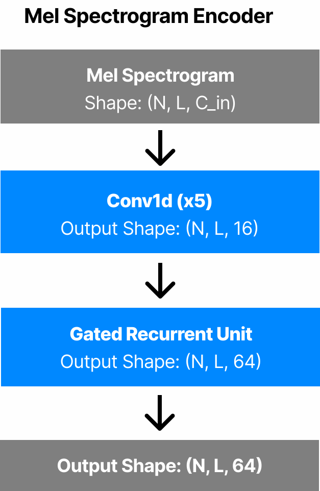
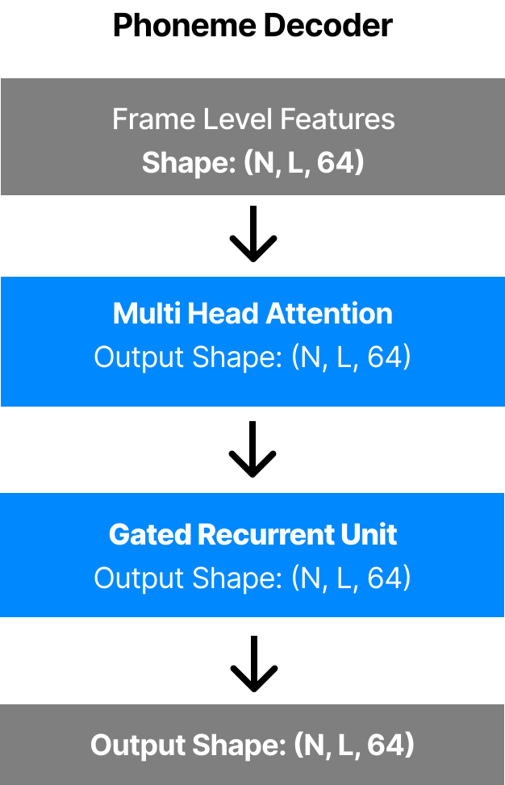

# Dhvani-187k
### Phoneme-level Mispronunciation Detection Model for Hindi with Feedback System
India has a vast array of regional languages with diverse origins. This presents a steep pronunciation hurdle for non-native speakers. Current language learning tools offer no guidance for regional variations and lack crucial pronunciation feedback. This creates a barrier to communication, cultural integration, and hinders confidence development for learners.  
A CAPT system designed specifically for **India's local languages is essential to bridge this gap**.

### We propose 
A Computer-Aided Pronunciation Training (CAPT) system using deep neural networks to detect phoneme-level pronunciation errors made by language learners. Dhvani provides real-time feedback, guiding users on how to improve their pronunciation accurately for regional Indian languages like Hindi, Punjabi, Marathi, and others. 

### Details of our layers

   

