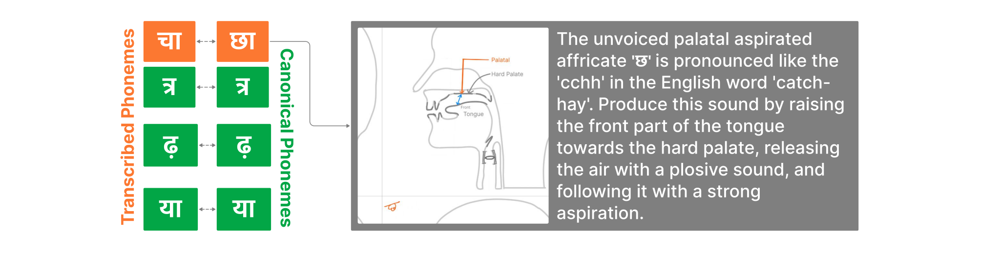

# Dhvani: A Weakly-supervised Phonemic Error Detection and Feedback System for Hindi

## Introduction

Dhvani is a novel Computer-Assisted Pronunciation Training (CAPT) system designed specifically for Hindi, addressing the critical gap in pronunciation tools for Indian languages. With over 500 million Hindi speakers, improving Hindi pronunciation is a vital step toward enhancing communication and connectivity within India's linguistically diverse landscape.

## Key Features

1. **Phonemic Error Detection**: Utilizes a weakly-supervised encoder-decoder structure for accurate detection of pronunciation errors at the phoneme level.
2. **Synthetic Speech Generation**: Implements innovative techniques to create diverse datasets for training, overcoming the scarcity of mispronounced speech data.
3. **Targeted Feedback Mechanism**: Provides detailed, actionable feedback to learners, including instructions on tongue position, lip movement, and teeth placement, supplemented by visual aids.
4. **Hindi-Specific Design**: Leverages Hindi's phonetic nature for more elegant handling of mispronounced speech and addresses challenges faced by diverse linguistic groups.

## Model Architecture

Dhvani's architecture consists of two main components:

1. **R-CNN Mel-Spectrogram Encoder**: Processes input speech through pre-processing to generate a mel-spectrogram, which is then fed into a Recurrent Convolutional Neural Network (RCNN) for feature extraction.

2. **A-RNN Phoneme Decoder**: An Attention-based Recurrent Neural Network (ARNN) that decodes the extracted features into phoneme sequences.

The output is then passed through a Classification Head with 67 units, corresponding to Hindi phonemes and special tokens.

## Dataset

The model is trained on a combination of:

1. **MUCS Dataset**: A subset of the Multilingual and Code-switching ASR Challenge dataset, containing 95.05 hours of training data and 5.55 hours of test data from telephone-quality Hindi speech recordings.

2. **Synthetic Dataset**: Over 3 hours of synthetic Hindi speech generated using the suno/bark-small text-to-speech model, comprising 1,000 correctly pronounced and 1,000 mispronounced sentence pairs.

## Performance

Dhvani demonstrates significant improvements over existing CAPT systems:

- **Recall**: 75.48%
- **Precision**: 89.94%
- **F-measure**: 82.24%

These results set a new benchmark for Hindi pronunciation training.

## Feedback Mechanism

Dhvani provides comprehensive phonetic feedback covering the full range of Hindi phonology:

- Detailed articulatory guidance for each phoneme
- Visual aids including tongue diagrams
- Comparisons to English phonemes for non-native speakers
- Special attention to challenging aspects like retroflex and aspirated consonants

## Future Work

The research presents promising avenues for future development:

1. Adaptation to other Indian languages
2. Integration with language learning platforms
3. Enhancement of the feedback system with more interactive elements
4. Exploration of real-time pronunciation correction in conversational settings

